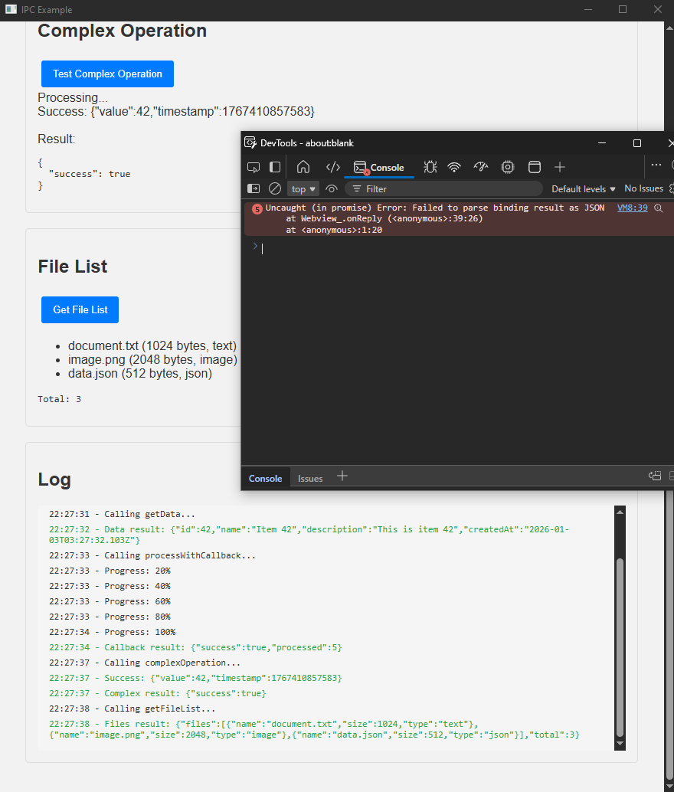

# IPC 
## Installation

```bash
# Dependencies are already installed
bun install
```


## Example

```bash
bun run example.ts
```

## links
- [forked exoRift repository](https://github.com/exoRift/webview-bun)
- [original repository](https://github.com/tr1ckydev/webview-bun)

- [actions](https://github.com/nglmercer/webview-bun/actions) # from exoRift

## Notes
- find issues with IPC communication
